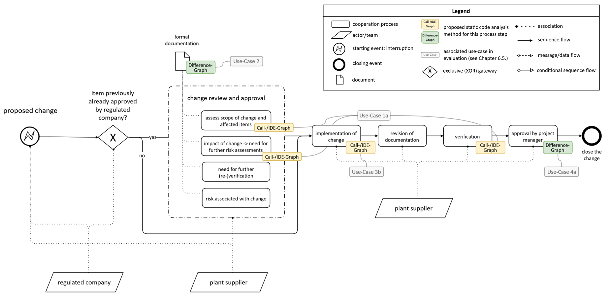
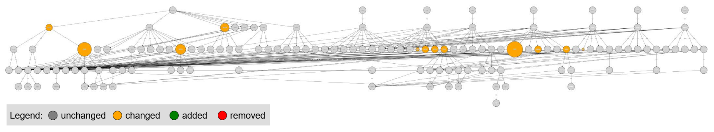

# Bachelor's Thesis

This repository contains the written PDF version of my Bachelor's thesis with the Institute of Automation and Information Systems at the Technical University of Munich (TUM).

**Thesis title:**  
*Combination of Workflow Modelling and Static Code Analysis to Assess the Effect of Changes in Industrial Automation Software for Recertification in the MedTech Domain*

Please note that this repository does not necessarily represent the exact final version that was officially submitted and graded.

## Overview

This thesis investigates how static code analysis methods can be integrated into recertification workflows for industrial automation software in the MedTech domain.

As a central contribution, it proposes a concept that combines workflow modelling with graphical static code analysis methods in order to support engineers in assessing the impact of software changes, improving communication, and assisting documentation and approval processes.

The concept was validated on industrial-scale case studies and evaluated together with industry experts.

## Main Concept on the Example of Project Change Mangement

One part of the main idea of the thesis is illustrated by **Figure 6**, which shows the proposed integration of helpful graph-based analysis methods into a GAMP-derived workflow for **project change management**, as opposed to **operational change management** (see Figure 7 in *Bachelor Thesis.pdf*).

*Figure 6: Specific GAMP-suggested workflow for project change management, highlighting the integration of helpful graphs as part of the proposed concept.*

## Example Analysis Output

To complement the workflow-level concept, **Figure 10** shows an example of a **Difference Graph**, which is used to visualize and communicate changes between software versions.

*Figure 10: Difference Graph of sub-plant B versions, with scaling of POUs proportional to change of the “FanIn FanOut” metric.*

## Contents

- `Bachelor Thesis.pdf` – main thesis document
- `images/figure_6.png` – workflow-level overview of the proposed concept
- `images/figure_10.png` – example Difference Graph from the thesis
